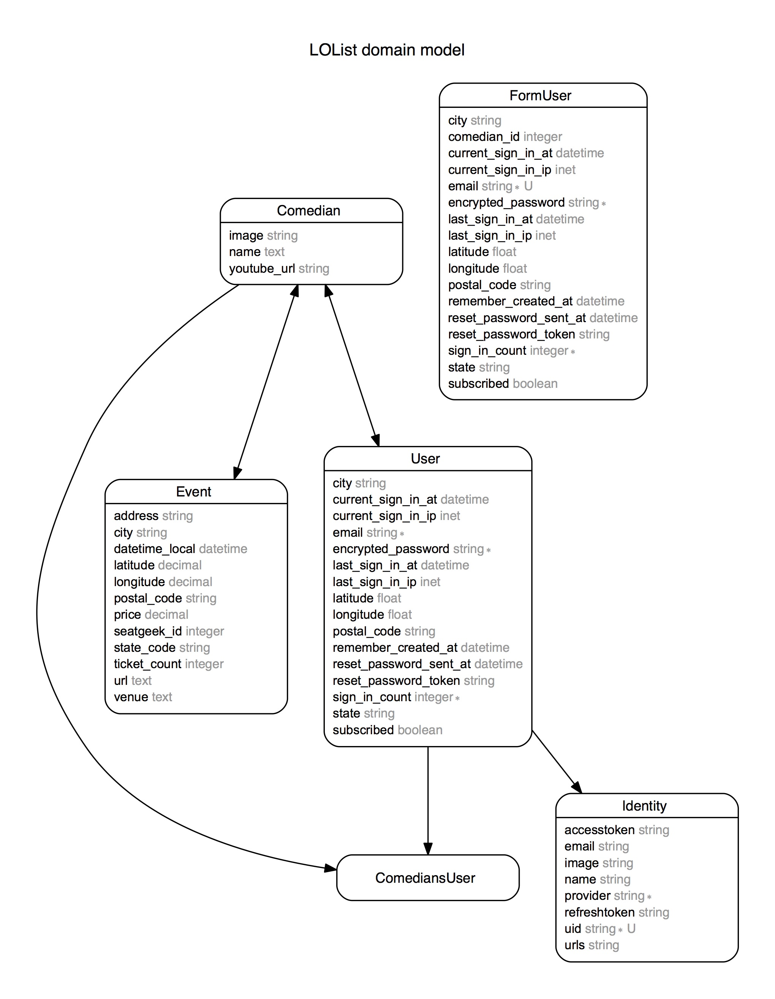

#LOList 
---
LOList is a web app that displays a curated list of popular comedians, allows it's users to follow their favorite ones and recieve notifications for any upcoming shows nearby.

[LOList.io]

## Minimum Viable Product

User:
<!-- Markdown checklist to keep track of progress -->
- [x] can sign up with a valid email and password
- [x] can sign up via Facebook OAuth
- [x] can sign in securely
- [x] should recieve an email when tickets are made available

## Wireframe
image of wireframe will go here

## ERD
<!-- ![image of Erd] -->

<!-- future to do items -->
TODO:
- [ ] Facebook login location 
- [ ] Comedians that have shows coming up need to send email once when selected (rather than on creation of event only) 
- [ ] Facebook like/share features 
- [ ] Google Oauth 
- [ ] Twitter Oauth 

[LOList.io]: http://lolist.io
